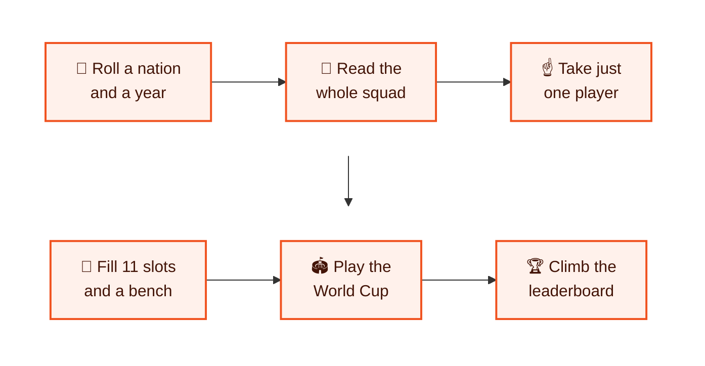
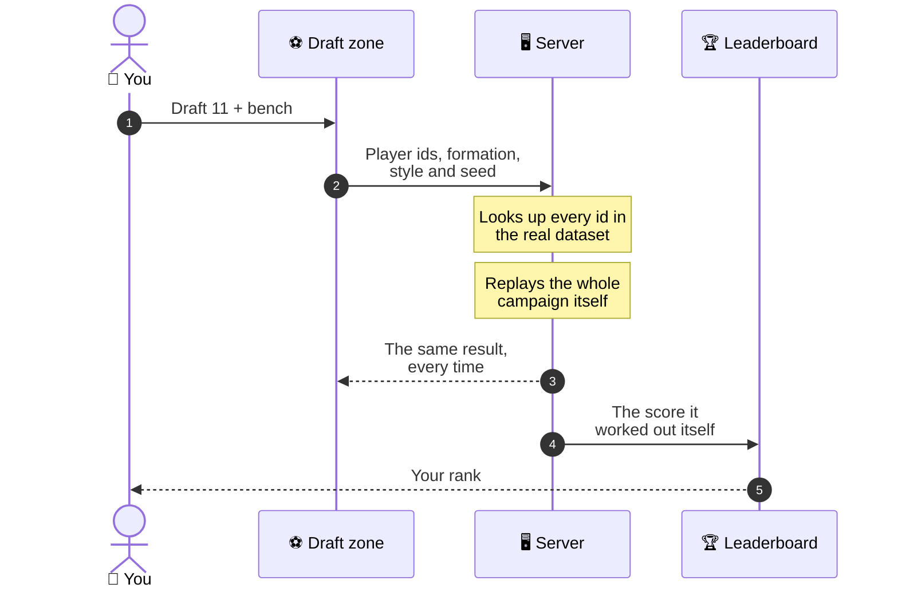
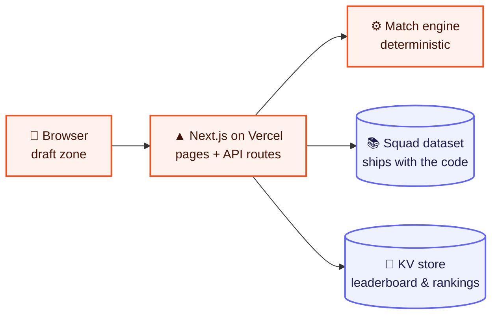
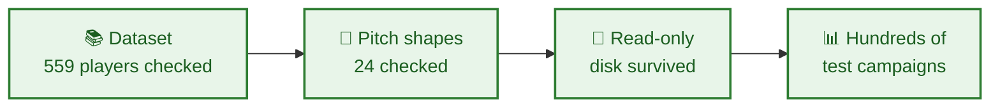

<div align="center">

# ⚽ Draft XI

### A World Cup draft game for people who argue about lineups

**Roll a national squad from any World Cup since 1970, take one real player per turn,<br/>name a bench — then send your side out and see how far it gets.**

<br/>

### ▶ [Play it now — no sign-up](https://draftxi-seven.vercel.app/play)

<br/>

   
<br/>
  

    

</div>

---

## 👋 In 30 seconds

<table>
<tr>
<td width="22%">

😟 **The problem**

</td>
<td>

Every football fan has an all-time XI in their head, and no way to prove it would actually win. Fantasy games are about this season's points, not about building a side across the history of the World Cup.

</td>
</tr>
<tr>
<td width="22%">

💡 **The idea**

</td>
<td>

Each turn hands you a random squad — Brazil 1970, Cameroon 1990, Morocco 2022 — and you may take **one** player from it. Then the market closes. Fill eleven positions and a bench, and a match engine plays out the whole tournament.

</td>
</tr>
<tr>
<td width="22%">

🎯 **Who it's for**

</td>
<td>

Football fans who enjoy the argument. It plays in the browser in a few minutes, with no account.

</td>
</tr>
<tr>
<td width="22%">

🚦 **Where it is**

</td>
<td>

**Live** at [draftxi-seven.vercel.app](https://draftxi-seven.vercel.app), with player rankings and a top-100 leaderboard.

</td>
</tr>
</table>

---

## 🧭 How it plays



---

## ✨ What makes it fun

<table>
<tr>
<td width="50%" valign="top">

### ☝️ One draw, one player
You can read every name in the squad, but only one joins your side. Every player you walk past is gone. Three rerolls let you swap the nation or the year when a squad can't fill the gap you have.

</td>
<td width="50%" valign="top">

### 🧩 The formation is the puzzle
Eight shapes, from a 4-2-4 that needs four forwards to a 5-3-2 that wants five defenders. A player is only worth taking if he fills a slot you actually have open.

</td>
</tr>
<tr>
<td valign="top">

### 🪑 A real bench
Seven substitute slots, laid out like a matchday sheet. Each slot only accepts someone who can do that job — and when legs go in the knockouts, the bench decides whether your shape survives an injury.

</td>
<td valign="top">

### 🏟️ A full tournament
Three group games and four knockout rounds, scored on attack, defence, balance, role fit and bench depth. Level after 90 minutes in a knockout goes to penalties, decided largely by your keeper.

</td>
</tr>
<tr>
<td valign="top">

### 📈 Players remember
Every campaign updates each player's record — appearances, results and titles — which becomes their ranking and a ▲/▼ form figure the next time they turn up in a draw.

</td>
<td valign="top">

### 🎛️ Your way to play
**Classic** shows ratings; **Almanac** hides them and makes you draft from memory. Three styles — defensive, balanced, attacking — change how the same eleven line up and how many goals go in at both ends.

</td>
</tr>
</table>

In the game's own test runs, a strong XI **with** a full bench won the tournament 58 times in 200; the same XI with **no** bench won it 5 times. The bench is not decoration.

---

## 📮 How one campaign is scored — fairly



The browser never gets to say what score it earned. The server rebuilds the side from real player ids and replays the campaign itself, which is why every score on the leaderboard can be checked.

---

## 🏗️ How it's built



| Layer | Tool | Why this one |
|---|---|---|
| 🖥️ Website | **Next.js 16 + React 19 + TypeScript** | Pages and the server API in one project |
| 🎨 Look and feel | **Tailwind CSS 4 + Motion** | Quick, consistent styling and smooth animation |
| ✅ Validation | **Zod** | Every draft sent to the server is checked before it's trusted |
| 💾 Storage | **Vercel KV / Upstash** *(optional)* | Makes the leaderboard permanent; without it the game still plays perfectly |
| ☁️ Hosting | **Vercel** | Every push to `master` redeploys the live site |

Drafting and simulating need no database at all — the squads ship with the code. Only the leaderboard and player rankings are saved, and there's a Drizzle schema ready if they ever move to Postgres.

---

## 🛡️ Built to be trusted

| | What it means | How it's done |
|---|---|---|
| 🎯 | **Same draft, same result** | The simulation is deterministic: the same picks, formation, style and seed always replay the same campaign. |
| 🔒 | **Scores can't be faked** | The server resolves every player id against the real dataset, rejects anything invented, and re-simulates before storing a score. |
| 🔁 | **No double counting** | Recording a campaign is keyed on the draft itself, so a refresh or a double click can't inflate anyone's ranking. |
| 🧱 | **Never breaks on a read-only server** | If saving fails, the game carries on and says so on the page, rather than taking the draft down with it. |
| 🎞️ | **Animation never blocks the game** | No screen waits on an animation, so a background tab can't leave the board stuck. |

`npm run check` proves the data and the model on demand:



It catches duplicate shirt numbers, squads without a keeper, formation slots no one can fill and out-of-range ratings — then plays hundreds of campaigns so you can see the goals, injuries and styles still look like football.

---

<a name="roadmap"></a>

## 🗺️ What's live

| Status | Feature |
|:---:|---|
| ✅ | The draft: 16 nations, 31 squads, 559 players, World Cups from 1970 to 2026 |
| ✅ | Eight formations, three styles, a seven-slot bench and three rerolls |
| ✅ | A full tournament with penalties, injuries and substitutions |
| ✅ | Classic and Almanac modes |
| ✅ | Player rankings with form, and a top-100 leaderboard with server-checked scores |
| ✅ | Live on Vercel, redeployed on every push |

---

## 📁 What's in this repository

```
📦 Draft XI
├── 📂 src/
│   ├── app/          the pages (play, players, leaderboard, rules…) and the API
│   ├── components/   the draft zone: squad board, pitch, bench, scorecard
│   ├── content/      the guide text shared by the landing page and help pages
│   └── lib/          the dataset, formations, the match engine and player records
├── 📂 scripts/       the checks, calibration and sample campaigns
└── 📂 docs/          the full developer guide
```

---

## 👩‍💻 For developers

You need **Node.js** (current LTS).

```bash
npm install
```

```bash
npm run dev
```

Then open <http://localhost:3000>. Before changing the data or the match engine, run:

```bash
npm run check
```

**The full developer guide is in [`docs/DEVELOPER-GUIDE.md`](docs/DEVELOPER-GUIDE.md):**

| Topic | Jump to |
|---|---|
| ⚽ Every rule of the game | [How it plays](docs/DEVELOPER-GUIDE.md#how-it-plays) |
| 🚀 Commands and checks | [Running it](docs/DEVELOPER-GUIDE.md#running-it) |
| ☁️ Your own copy on Vercel | [Deploying](docs/DEVELOPER-GUIDE.md#deploying) |
| 🗂️ Where things live, and the rules the code follows | [Layout](docs/DEVELOPER-GUIDE.md#layout) |

The squad data is a curated selection built for gameplay, and ratings are judgement calls. Not affiliated with FIFA or any national association.

---

<div align="center">

**Built by [Aryan Deshmukh](https://github.com/AryanDeshmukh-2711)** · [Play Draft XI](https://draftxi-seven.vercel.app/play)

</div>
